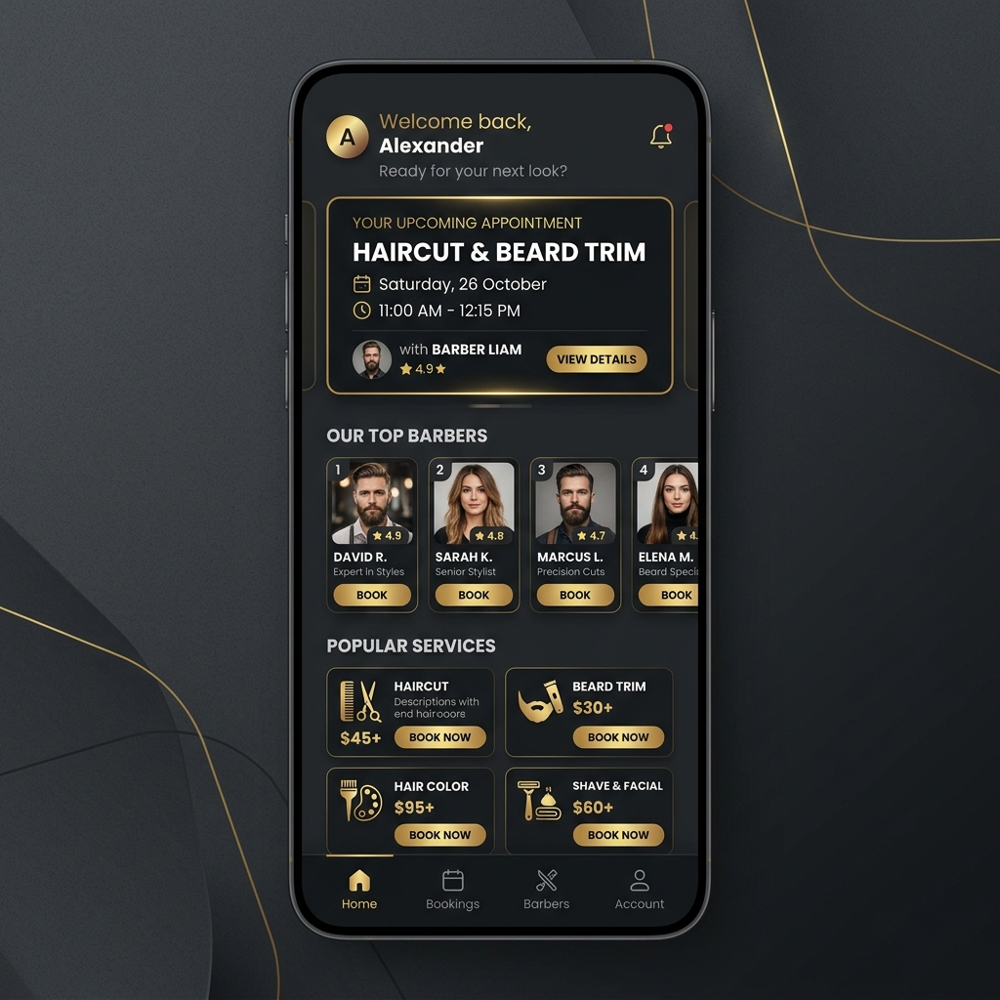
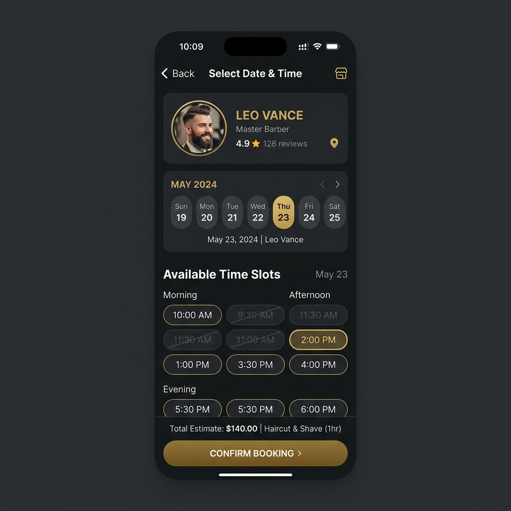
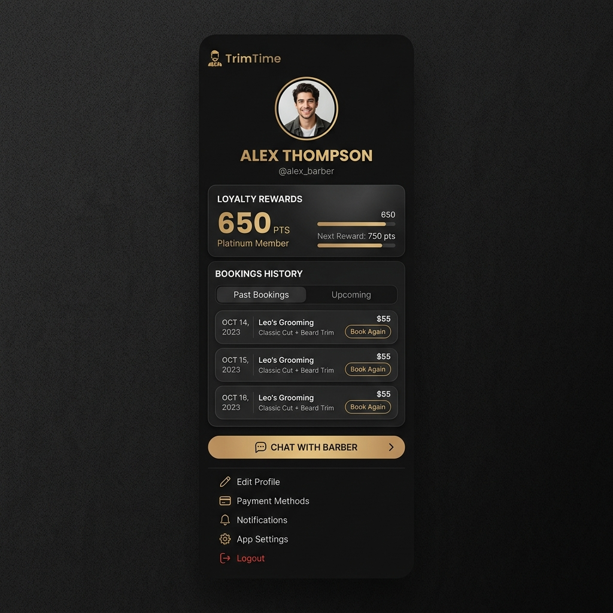

# BarberShop - Ứng dụng đặt lịch cắt tóc

Ứng dụng **BarberShop** là giải pháp toàn diện giúp số hóa trải nghiệm đặt lịch cắt tóc.

## 🎯 Bài toán giải quyết
- **Đối với khách hàng:** Dễ dàng tìm kiếm thợ cắt tóc yêu thích, chọn dịch vụ, đặt lịch hẹn trước để không phải chờ đợi tại quán.
- **Đối với cửa hàng/quản lý:** Quản lý lịch hẹn hiệu quả, theo dõi doanh thu của thợ cắt tóc, tự động hóa quy trình quản lý nhân sự và có hỗ trợ trò chuyện (chat) trực tiếp với khách hàng.

## 💻 Công nghệ sử dụng (Frontend)
Dự án được xây dựng với các công nghệ Frontend hiện đại trên thiết bị di động:
- **Framework:** Flutter (chạy đa nền tảng)
- **Ngôn ngữ:** Dart
- **Quản lý trạng thái (State Management):** Provider
- **Tương tác API (Networking):** Dio
- **Định dạng dữ liệu:** Intl (định dạng thời gian, tiền tệ theo múi giờ Việt Nam)
- **UI/UX & Tối ưu:** Cung cấp sẵn Theme Sáng/Tối (Light/Dark mode), sử dụng package `shimmer` cho hiệu ứng loading đẹp mắt và `cached_network_image` để tải, lưu trữ ảnh bộ nhớ đệm.

## 📸 Ảnh màn hình ứng dụng (Screenshots)

Dưới đây là một số hình ảnh giao diện nổi bật của ứng dụng:

### 1. Màn hình Trang Chủ (Home Screen)
Hiển thị danh sách dịch vụ, các thợ cắt tóc nổi bật và các lịch trình sắp tới.

### 2. Màn hình Đặt Lịch Hẹn (Booking Screen)
Khách hàng có thể chọn ngày và khung giờ linh hoạt thông qua giao diện dễ thao tác.

### 3. Màn hình Hồ Sơ/Cá Nhân (Profile)
Nơi khách hàng quản lý thông tin thành viên, xem lịch sử cắt tóc và thực hiện giao tiếp hỗ trợ.

